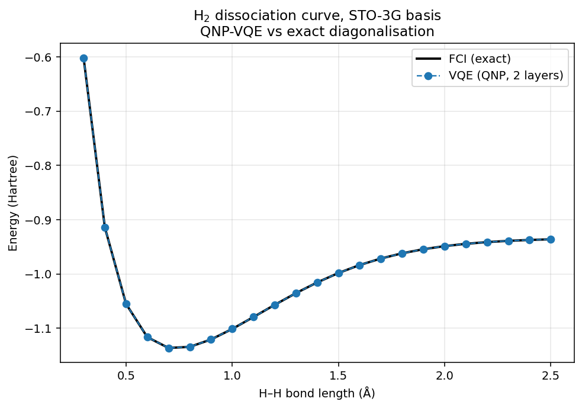

# quantum-ml-comparator

[](https://github.com/orbion-life/quantum-ml-comparator/actions/workflows/test.yml)
[](https://github.com/orbion-life/quantum-ml-comparator/actions/workflows/lint.yml)
[](https://pypi.org/project/quantum-ml-comparator/)
[](https://pypi.org/project/quantum-ml-comparator/)
[](LICENSE)
[](https://codecov.io/gh/orbion-life/quantum-ml-comparator)

> Developed at [Orbion GmbH](https://orbion.life).

**Compare quantum machine learning algorithms against classical ML — with automatic QML recommendations.**

A general-purpose open-source framework to benchmark QML vs classical ML on your own datasets. Tell it what classical algorithm you're using and it recommends which quantum algorithms to compare against, explains why, and runs the comparison for you.

## Install

```bash
pip install quantum-ml-comparator
```

Optional extras:

```bash
pip install "quantum-ml-comparator[molecules]"  # adds pyscf for VQE demos
pip install "quantum-ml-comparator[dev]"        # pytest, ruff, mypy
```

Python ≥ 3.9. Supported backends: PennyLane's `default.qubit` (CPU) out of the box; `lightning.qubit` if you install `pennylane-lightning`.

## Quickstart

```python
from qmc import Benchmark

bench = Benchmark(dataset="iris", classical_methods=["MLP", "SVM", "RF"])
bench.run()
bench.report("results/")
```

Quantum methods are **auto-recommended** based on your classical methods — see the [mappings table](#mapping-reference) below.

## scikit-learn compatible estimators

`VQCClassifier` and `QuantumKernelClassifier` satisfy the `BaseEstimator` + `ClassifierMixin` contract, so they drop into any existing sklearn pipeline:

```python
from sklearn.pipeline import Pipeline
from sklearn.preprocessing import StandardScaler
from sklearn.model_selection import cross_val_score
from qmc import VQCClassifier

pipe = Pipeline([
    ("scaler", StandardScaler()),
    ("vqc", VQCClassifier(n_qubits=4, n_layers=2, epochs=20)),
])
scores = cross_val_score(pipe, X, y, cv=5)
```

Persistence: use `joblib` or `cloudpickle` (stdlib `pickle` doesn't handle PennyLane QNode closures).

## QML algorithm recommender

Don't know which quantum algorithm to try? Ask:

```python
from qmc import print_recommendations

print_recommendations("RandomForest")
```

Output:

```
[PRIMARY] Quantum Kernel Ensemble  (difficulty: medium)
  Ensemble of quantum-kernel SVMs on bootstrap samples, mimicking Random Forest's bagging.
  Rationale: Combining multiple quantum kernel models reduces variance, similar to how
             Random Forest aggregates decision trees.
  Circuit:   8 qubits, 4 layers

[SECONDARY] VQC  (difficulty: easy)
  Variational Quantum Classifier as a single strong learner replacing the tree ensemble.
  Rationale: A sufficiently expressive VQC can match an ensemble of weak learners.
```

Supported classical algorithms: **SVM, MLP, Random Forest, Logistic Regression, k-NN, XGBoost, Naive Bayes, PCA**. Anything else falls back to the general-purpose VQC / Quantum Kernel recommendations.

## What's included

### Classical baselines
MLP (PyTorch), SVM, Random Forest, Logistic Regression, k-NN, Gradient Boosting, Naive Bayes, Decision Tree.

### Quantum circuits
- **VQC** — Variational Quantum Classifier (binary + multiclass)
- **Quantum kernel** — IQP-style feature map + precomputed SVM
- **QNP ansatz** — particle-number-preserving gates (Anselmetti et al.)
- **HEA ansatz** — StronglyEntanglingLayers (generic)
- Plus factory helpers for custom circuits in `qmc.circuits.templates`

### Molecular VQE
Run VQE on standard benchmark molecules (H₂, HeH⁺, LiH, H₂O) with the QNP or HEA ansatz. The H₂ reproduction of Anselmetti et al. (2021) ships as an executable script:

```bash
python examples/reproduce_anselmetti_h2.py
# VQE matches FCI to < 1 mHa across the full dissociation curve
```



### Live dashboard
```python
from qmc.dashboard import start_dashboard
start_dashboard(port=8501)
# Open http://localhost:8501 for live training curves during bench.run()
```

## Bring your own data

```python
import numpy as np
from qmc import Benchmark

X = np.random.randn(500, 6)
y = (X[:, 0] * X[:, 1] > 0).astype(int)

bench = Benchmark(dataset=(X, y), classical_methods=["RF", "MLP"])
bench.run()
```

Or from a CSV:

```python
bench = Benchmark(dataset="data.csv", target_column="label")
```

Built-in datasets: `iris`, `breast_cancer`, `wine`, `digits`, `moons`, `circles`, `blobs`.

## Example output

Running `examples/01_quickstart.py` on Iris:

| Rank | Method | Type | Accuracy | F1 | Time |
|------|--------|------|----------|-----|------|
| 1 | VQC | quantum | 1.0000 | 1.0000 | 340.7s |
| 2 | QuantumKernel | quantum | 0.9556 | 0.9554 | 7.8s |
| 3 | MLP | classical | 0.9333 | 0.9333 | 0.06s |
| 4 | SVM | classical | 0.9111 | 0.9107 | 0.001s |
| 5 | RF | classical | 0.8889 | 0.8878 | 0.03s |

## Examples

- [`examples/01_quickstart.py`](examples/01_quickstart.py) — classical vs quantum on Iris
- [`examples/02_recommender.py`](examples/02_recommender.py) — get QML recommendations
- [`examples/03_molecule_vqe.py`](examples/03_molecule_vqe.py) — VQE on H₂ (requires PySCF)
- [`examples/04_custom_dataset.py`](examples/04_custom_dataset.py) — bring your own numpy data
- [`examples/reproduce_anselmetti_h2.py`](examples/reproduce_anselmetti_h2.py) — full H₂ VQE reproduction with sanity-gate assertions

## Mapping reference

| Your classical algorithm | Recommended quantum counterpart |
|--------------------------|--------------------------------|
| SVM | Quantum Kernel SVM, VQC |
| MLP / Neural Net | VQC, Data Re-uploading VQC |
| Random Forest | Quantum Kernel Ensemble, VQC |
| Logistic Regression | Quantum Kernel + Linear SVM |
| k-NN | Quantum Kernel k-NN |
| XGBoost | Quantum Kernel SVM, Quantum Boosted Ensemble |
| Naive Bayes | VQC with probabilistic readout |
| PCA | Quantum feature map, Quantum Autoencoder |
| *anything else* | VQC, Quantum Kernel (general-purpose) |

## Development

```bash
git clone https://github.com/orbion-life/quantum-ml-comparator.git
cd quantum-ml-comparator
pip install -e ".[dev]"
pytest tests/
```

Contributions welcome — see [`CONTRIBUTING.md`](CONTRIBUTING.md) for the dev workflow, code standards, and how to add a new QML algorithm or dataset. Bug reports and security issues: [`SECURITY.md`](SECURITY.md).

## Citation

If you use this package in your work, please cite it:

```bibtex
@software{quantum_ml_comparator,
  author  = {Goteti, Aniruddh},
  title   = {quantum-ml-comparator: quantum vs classical ML benchmarking with automatic algorithm recommendations},
  year    = {2026},
  url     = {https://github.com/orbion-life/quantum-ml-comparator},
  version = {0.2.1},
  organization = {Orbion GmbH}
}
```

GitHub also exposes a "Cite this repository" button (powered by [`CITATION.cff`](CITATION.cff)).

## License

[MIT](LICENSE). Use it anywhere.

## Acknowledgments

This repository was developed with AI coding assistance. The research direction, experimental design, verification, and technical decisions are original work; the code scaffolding was accelerated with Claude.

QNP gate implementation based on [Anselmetti et al. (2021)](https://arxiv.org/abs/2104.05695).
Built on [PennyLane](https://pennylane.ai/) and [scikit-learn](https://scikit-learn.org/).
